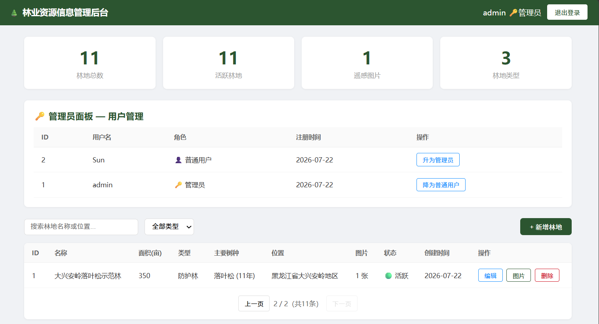
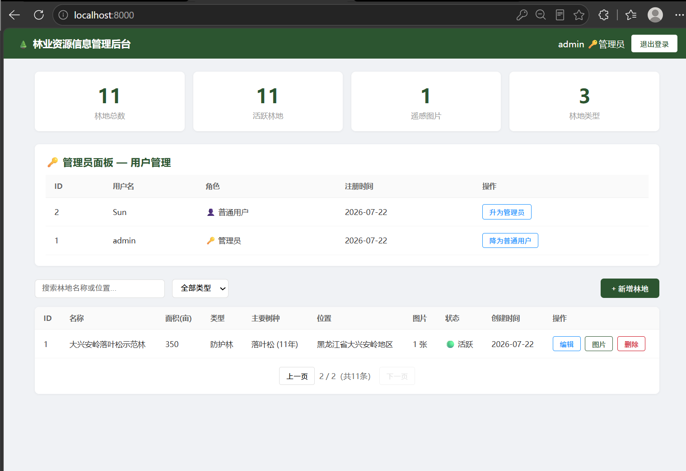
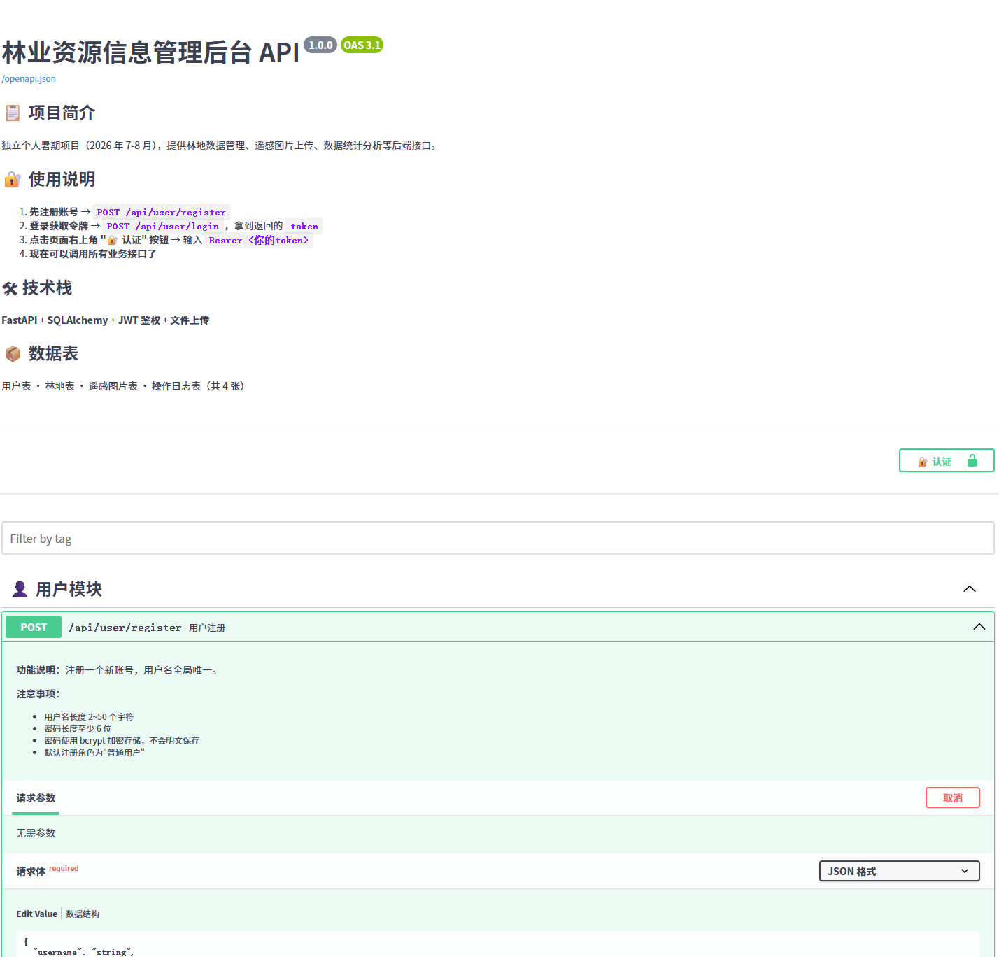
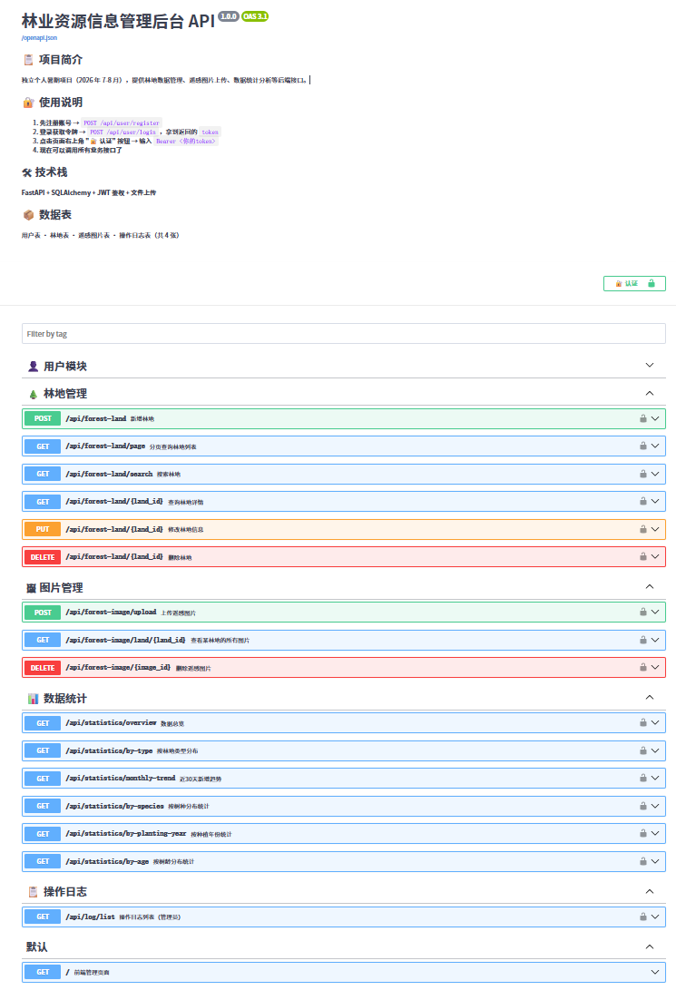
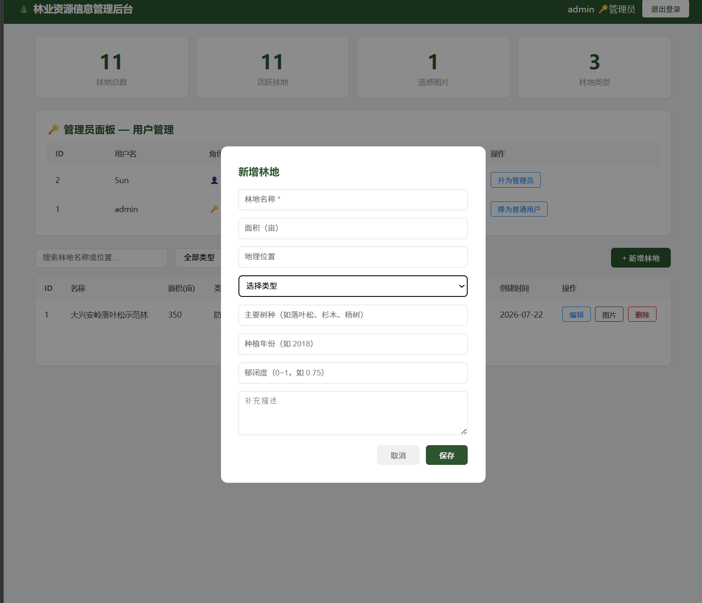

# 🌲 林业资源信息管理后台

> **独立个人暑期项目** | 2026.7 — 2026.8 | FastAPI + SQLAlchemy + JWT
>
> 🔗 **在线演示**：[前端管理页面](http://localhost:8000/) | [Swagger 接口文档](http://localhost:8000/docs)
>
> 📦 **GitHub**：https://github.com/SunMohan2006/forest-backend

---

## 📋 项目简介

一个完整的林业资源信息管理后端系统，从零独立开发，涵盖用户认证、林地数据 CRUD、遥感图片上传管理、数据统计分析、操作日志追踪，以及 **管理员/普通用户双角色权限控制**。

**开发目标**：
- 实践后端开发完整流程：需求分析 → 数据库设计 → 接口开发 → 前端页面 → 权限控制
- 产出可在线访问、可演示、有完整文档的项目作品集
- 面向保研/求职面试，证明独立开发能力

### 📸 项目截图

| 前端管理页面 | Swagger 接口文档 |
|-------------|-----------------|
|  |  |

| 新增林地（林业字段） | 图片管理（含经纬度） |
|-------------------|---------------------|
|  |  |

| 统计总览 | 管理员面板 |
|---------|-----------|
|  |  |

---

## 🛠 技术栈

| 层级 | 技术 | 说明 |
|------|------|------|
| 后端框架 | **FastAPI** (Python) | 自动生成 Swagger 接口文档 |
| 数据库 | **SQLite**（默认）/ **MySQL**（可选） | SQLite 免配置开箱即用，生产环境切 MySQL |
| ORM | **SQLAlchemy 2.0** | 数据模型与表映射 |
| 认证 | **JWT** (python-jose) | 无状态令牌认证，24小时有效期 |
| 密码加密 | **bcrypt** | 密码加盐哈希存储，不保存明文 |
| 文件上传 | **python-multipart** | 遥感图片上传，UUID 防冲突命名 |
| 前端 | **原生 HTML/CSS/JS** | 单文件 SPA，登录 → 数据管理 → 图片查看 |
| API 文档 | **Swagger UI**（已汉化） | `/docs` 页面全中文，面试官打开即懂 |

---

## 🏗 系统架构

```
┌──────────────────────────────────────────────────┐
│                前端管理页面 (/)                      │
│       登录/注册 → 统计卡片 → 林地列表 → 图片管理        │
├──────────────────────────────────────────────────┤
│            Swagger 接口文档 (/docs)                 │
│           全中文汉化，支持在线调试                       │
├──────────────────────────────────────────────────┤
│                Router 路由层                        │
│     👤 用户模块  🌲 林地管理  🖼 图片管理  📊 统计      │
├──────────────────────────────────────────────────┤
│              Service 业务逻辑层                      │
│     注册/登录 · 林地CRUD · 图片上传                   │
│     ┌──────────────┐                               │
│     │ _check_permission()  ← 权限校验（创建者/管理员）  │
│     └──────────────┘                               │
├──────────────────────────────────────────────────┤
│           SQLAlchemy ORM 数据访问层                 │
├──────────────────────────────────────────────────┤
│          SQLite / MySQL 数据库                      │
│   user · forest_land · forest_image · operation_log │
│   🌲 tree_species · planting_year · canopy_density  │
│   🛰 latitude · longitude（遥感图片地理坐标）         │
├──────────────────────────────────────────────────┤
│           本地文件存储 (uploads/)                     │
└──────────────────────────────────────────────────┘
```

---

## 📦 数据库设计（4 张表）

### ER 关系图

```
user (1) ──────< (N) forest_land (1) ──────< (N) forest_image
  │
  └───────────< (N) operation_log
```

### user — 用户表

| 字段 | 类型 | 说明 |
|------|------|------|
| id | INTEGER PK | 用户ID |
| username | VARCHAR(50) UNIQUE | 用户名 |
| password | VARCHAR(255) | 密码（bcrypt 加密） |
| role | VARCHAR(20) | 角色：ADMIN / USER |
| created_at | DATETIME | 注册时间 |

### forest_land — 林地表

| 字段 | 类型 | 说明 |
|------|------|------|
| id | INTEGER PK | 林地ID |
| name | VARCHAR(100) | 林地名称 |
| area | DECIMAL(10,2) | 面积（亩） |
| location | VARCHAR(255) | 地理位置 |
| land_type | VARCHAR(50) | 用材林/防护林/经济林/薪炭林/特用林 |
| tree_species | VARCHAR(100) | 🌲 主要树种（落叶松、杉木、杨树等） |
| planting_year | INTEGER | 🌲 种植年份 |
| canopy_density | DECIMAL(3,2) | 🌲 郁闭度（0.00~1.00，<0.3疏林 / 0.3~0.7中度 / >0.7密林） |
| description | TEXT | 描述 |
| status | VARCHAR(20) | ACTIVE / INACTIVE |
| created_by | INTEGER FK→user.id | 创建人 |
| created_at | DATETIME | 创建时间 |
| updated_at | DATETIME | 更新时间 |

### forest_image — 遥感图片表

| 字段 | 类型 | 说明 |
|------|------|------|
| id | INTEGER PK | 图片ID |
| land_id | INTEGER FK→forest_land.id | 所属林地 |
| image_url | VARCHAR(500) | 图片存储路径 |
| original_name | VARCHAR(255) | 原始文件名 |
| file_size | INTEGER | 文件大小（字节） |
| latitude | DECIMAL(9,6) | 🛰 纬度（WGS84 坐标） |
| longitude | DECIMAL(9,6) | 🛰 经度（WGS84 坐标） |
| uploaded_at | DATETIME | 上传时间 |

### operation_log — 操作日志表

| 字段 | 类型 | 说明 |
|------|------|------|
| id | INTEGER PK | 日志ID |
| user_id | INTEGER FK→user.id | 操作人 |
| action | VARCHAR(50) | CREATE / UPDATE / DELETE |
| target | VARCHAR(100) | 操作对象 |
| target_id | INTEGER | 操作对象ID |
| detail | VARCHAR(500) | 操作详情 |
| created_at | DATETIME | 操作时间 |

---

## 🔐 权限控制

| 操作 | 未登录 | 普通用户 | 管理员 |
|------|--------|----------|--------|
| 注册 / 登录 | ✅ | ✅ | ✅ |
| 查看所有林地 | ❌ | ✅ | ✅ |
| 新增林地 | ❌ | ✅ | ✅ |
| 修改/删除**自己的**林地 | ❌ | ✅ | ✅ |
| 修改/删除**别人的**林地 | ❌ | ❌ 403 | ✅ |
| 上传图片到**自己的**林地 | ❌ | ✅ | ✅ |
| 上传图片到**别人的**林地 | ❌ | ❌ 403 | ✅ |
| 查看用户列表 | ❌ | ❌ | ✅ |
| 升降用户角色 | ❌ | ❌ | ✅ |

> 实现细节：在 Service 层通过 `_check_permission()` 校验 `created_by` 字段，管理员绕过；Router 层统一捕获 `PermissionError` 返回 403。

---

## 📡 API 接口清单（18 个）

### 👤 用户模块

| 方法 | 路径 | 说明 | 认证 | 权限 |
|------|------|------|------|------|
| POST | `/api/user/register` | 用户注册 | 否 | — |
| POST | `/api/user/login` | 用户登录，返回 JWT | 否 | — |
| GET | `/api/user/list` | 查看所有用户 | 是 | 管理员 |
| PUT | `/api/user/{id}/role` | 修改用户角色 | 是 | 管理员 |

### 🌲 林地管理

| 方法 | 路径 | 说明 | 认证 |
|------|------|------|------|
| POST | `/api/forest-land` | 新增林地 | 是 |
| GET | `/api/forest-land/page` | 分页查询（支持搜索+类型筛选） | 是 |
| GET | `/api/forest-land/search` | 按关键词搜索 | 是 |
| GET | `/api/forest-land/{id}` | 查询林地详情 | 是 |
| PUT | `/api/forest-land/{id}` | 修改林地（仅创建者/管理员） | 是 |
| DELETE | `/api/forest-land/{id}` | 删除林地（仅创建者/管理员） | 是 |

### 🖼 图片管理

| 方法 | 路径 | 说明 | 认证 |
|------|------|------|------|
| POST | `/api/forest-image/upload` | 上传遥感图片（仅创建者/管理员） | 是 |
| GET | `/api/forest-image/land/{landId}` | 查看某林地的所有图片 | 是 |

### 📊 数据统计

| 方法 | 路径 | 说明 | 认证 |
|------|------|------|------|
| GET | `/api/statistics/overview` | 林地总数/活跃数/图片总数 | 是 |
| GET | `/api/statistics/by-type` | 按林地类型分布统计 | 是 |
| GET | `/api/statistics/by-species` | 🌲 按树种分布统计（含总面积） | 是 |
| GET | `/api/statistics/by-planting-year` | 🌲 按种植年份统计 | 是 |
| GET | `/api/statistics/by-age` | 🌲 按树龄分布（幼/中/近/成/过熟林） | 是 |
| GET | `/api/statistics/monthly-trend` | 近30天每日新增趋势 | 是 |

---

## 🚀 快速开始

### 1. 环境要求

- **Python 3.9+**
- 数据库：默认使用 **SQLite**（零配置），可选切换 MySQL

### 2. 克隆项目

```bash
git clone https://github.com/SunMohan2006/forest-backend.git
cd forest-backend
```

### 3. 安装依赖

```bash
pip install -r requirements.txt
```

### 4. 启动服务

```bash
uvicorn app.main:app --reload --host 0.0.0.0 --port 8000
```

就这么简单——**不需要装数据库，不需要改配置**，启动就能用。

### 5. 打开浏览器

| 地址 | 用途 |
|------|------|
| http://localhost:8000/ | 🎯 前端管理页面 |
| http://localhost:8000/docs | 📋 Swagger 接口文档（中文） |

### 6. 初始账号

| 用户名 | 密码 | 角色 |
|--------|------|------|
| `admin` | `admin123` | 管理员（启动自动创建） |

---

## 🔧 可选：切换 MySQL

默认使用 SQLite，如需 MySQL：

```bash
# 1. 创建数据库
mysql -u root -p -e "CREATE DATABASE forest_db DEFAULT CHARSET utf8mb4;"

# 2. 设置环境变量
# Windows PowerShell:
$env:DB_TYPE = "mysql"
$env:DB_PASSWORD = "你的MySQL密码"

# Linux/Mac:
export DB_TYPE=mysql
export DB_PASSWORD=你的MySQL密码

# 3. 启动
uvicorn app.main:app --reload --host 0.0.0.0 --port 8000
```

---

## 📁 项目结构

```
forest-backend/
├── app/
│   ├── main.py                  ← FastAPI 启动入口
│   ├── config.py                ← 数据库/JWT/上传 配置
│   ├── database.py              ← SQLAlchemy 引擎 + Session
│   ├── models/                  ← ORM 数据模型（4张表）
│   │   ├── user.py
│   │   ├── forest_land.py
│   │   ├── forest_image.py
│   │   └── operation_log.py
│   ├── schemas/                 ← Pydantic 请求/响应校验
│   │   ├── user.py
│   │   ├── forest_land.py
│   │   └── forest_image.py
│   ├── routers/                 ← 路由控制器（15个接口）
│   │   ├── user.py
│   │   ├── forest_land.py
│   │   ├── forest_image.py
│   │   └── statistics.py
│   ├── services/                ← 业务逻辑 + 权限校验
│   │   ├── user_service.py
│   │   ├── forest_land_service.py
│   │   └── forest_image_service.py
│   ├── middleware/
│   │   └── auth.py              ← JWT 鉴权中间件
│   ├── utils/
│   │   ├── jwt_util.py          ← JWT 生成/解析
│   │   └── response.py          ← 统一返回格式 {code, message, data}
│   └── static/
│       ├── index.html           ← 前端管理页面
│       └── swagger-zh.js        ← Swagger 中文汉化脚本
├── sql/init.sql                 ← MySQL 建表脚本
├── uploads/                     ← 遥感图片存储
├── requirements.txt
└── README.md
```

---

## 🐛 开发日志

> 面试时这些踩坑细节最能证明项目是亲手写的——每个问题背后都是一段调试过程。

### 第一阶段：项目初始化（7 月 21 日）

| 时间 | 遇到的问题 | 排查过程 | 解决方案 |
|------|-----------|----------|----------|
| 7/21 上午 | **技术栈选型纠结**：设计文档写了 Spring Boot，但自己 Java 基础不扎实 | 对比了 Spring Boot 和 FastAPI 的学习曲线、生态、API 文档生成能力 | 改用 Python/FastAPI，语法更熟，自动生成 Swagger 文档省了大量写文档的时间 |
| 7/21 下午 | **`Column(BigInteger)` 导致 SQLite 报错**：SQLite 不支持 `BigInteger` 类型 | 查看 SQLAlchemy 文档发现 SQLite 的 INTEGER 最大就是 64 位有符号整数 | 将所有模型中的 `BigInteger` 改为 `Integer`，功能完全不变 |
| 7/21 下午 | **`passlib` 库与 Python 3.14 不兼容**：`passlib.hash.bcrypt` 内部调用了已废弃的 API | 查了 passlib 的 GitHub issue，发现项目已多年未更新 | 改用原生 `bcrypt` 库直接调用 `hashpw()` / `checkpw()`，更底层更稳定 |
| 7/21 晚上 | **MySQL 没装，项目跑不起来**：一开始写了 MySQL 连接，本地没装 MySQL 就一直报连接拒绝 | 想让面试官克隆下来就能跑，零配置 | 给 `config.py` 加 `DB_TYPE` 开关，默认 SQLite，想切 MySQL 设环境变量即可 |

### 第二阶段：接口文档优化（7 月 21 日 — 7 月 22 日）

| 时间 | 遇到的问题 | 排查过程 | 解决方案 |
|------|-----------|----------|----------|
| 7/21 晚上 | **Swagger 界面全是英文**："Try it out"、"Execute"、"Responses"……国内面试官看不懂 | FastAPI 的 `swagger_ui_parameters` 文档没提语言设置，试了 `customScriptUrl` 发现 Swagger UI 5.x 不支持 | 自己写了一个 `swagger-zh.js`，用 `MutationObserver` 监听 DOM 变化，把英文标签逐个替换成中文；同时自定义 `/docs` 路由把脚本注入 HTML |
| 7/22 上午 | **汉化脚本死循环**：`MutationObserver` 修改 DOM 又触发自身，页面卡死 | 发现 `translate()` 修改文本节点 → 触发 observer → 再调 `translate()`，形成死循环 | 翻译前先 `observer.disconnect()`，翻译完再 `observe()`，加 100ms 防抖 |

### 第三阶段：权限控制（7 月 22 日）

| 时间 | 遇到的问题 | 排查过程 | 解决方案 |
|------|-----------|----------|----------|
| 7/22 下午 | **任何人都能删任何人的数据**：发现不同用户登录后能看到所有林地，点了删除就真删了 | 检查代码，`delete()` 和 `update()` 没做任何身份校验，`role` 字段存了但完全是摆设 | 在 `forest_land_service.py` 加 `_check_permission()`：管理员全放行，普通用户对比 `land.created_by == user_id` |
| 7/22 下午 | **admin 账号角色是 USER 不是 ADMIN**：用 admin 登录测试，删别人的林地还是 403 | `init.sql` 里写了 `INSERT admin role='ADMIN'`，但 SQLite 走的是 SQLAlchemy `create_all`，init.sql 根本没执行 | 在 `main.py` 的 `on_startup` 里加了种子逻辑：查无 admin 就建一个，role 不对就修成 ADMIN |
| 7/22 下午 | **前端删别人林地只显示红色无错误信息**：userB 删 userA 的林地，弹了红框但里面没文字 | FastAPI 返回的 403 格式是 `{code:403, message:"无权删除..."}`，但 Pydantic 校验失败时返回的是 `{detail:[{msg:...}]}`，格式不一样，前端 `showMsg()` 只读了 `res.message` | 改 `api()` 函数统一处理：遇到 `detail` 数组就提取 `msg` 拼成字符串，转成 `{code, message}` 格式再返回 |

### 第四阶段：前端页面（7 月 22 日）

| 时间 | 遇到的问题 | 排查过程 | 解决方案 |
|------|-----------|----------|----------|
| 7/22 下午 | **FastAPI 挂载顺序导致静态文件 404**：`/static/` 挂载在路由注册之后，浏览器访问 `/static/index.html` 返回 404 | FastAPI 的路由匹配是"先挂载先匹配"，`/docs` 自定义路由注册后，后面的 mount 可能被前面的 catch-all 拦截 | 把 `app.mount("/static", ...)` 挪到 `app.include_router(...)` 之前 |
| 7/22 晚上 | **前端登录后需要刷新才显示管理界面**：`handleLogin` 成功后 `showMain()` 执行了但看不到效果 | CSS 里 `#mainContent` 默认 `display:none`，JS 里改成了 `style.display='block'`，但前面的 `loginPage` 只是加了 `hidden` class，DOM 渲染顺序问题 | `showMain` 里把 `loginPage` 加上 `hidden`、`mainContent` 设 `display:block`，确保互斥 |

### 第五阶段：安全加固 + 性能优化 + 林业差异化（7 月 22 日）

| 时间 | 遇到的问题 | 排查过程 | 解决方案 |
|------|-----------|----------|----------|
| 7/22 下午 | **JWT SECRET_KEY 硬编码在代码里**：任何克隆项目的人都能看到 `config.py` 里的默认密钥，可伪造任意用户的 JWT | 想了三种方案：① 强制环境变量（新手不友好）；② 启动时随机生成（重启后所有用户被迫重新登录）；③ 随机生成 → 持久化文件（兼顾安全与体验） | 采用方案③：启动时按优先级取 `环境变量 > .secret_key 文件 > 随机生成写入文件`，`.secret_key` 已加入 .gitignore |
| 7/22 傍晚 | **林地列表查询性能差**：`page_query` 中每查一条林地就单独 `COUNT` 一次图片数，10 条 = 11 次数据库查询（经典 N+1 问题） | 用 SQLAlchemy 的 `func.count` + `group_by` 测试，确认可以一次查出所有 land_id 对应的图片数 | 先用 `land_id.in_()` 批量查出所有图片计数 → 存为 `{land_id: count}` 字典 → 循环中直接 `dict.get()`，11 次查询变 2 次 |
| 7/22 傍晚 | **项目缺乏林业特色**：回头审视自己的代码，发现把表名从 `forest_land` 换成 `student`、`land_type` 换成 `major` 代码零改动也能跑，跟"学生管理系统"没区别——这算哪门子林业项目？ | 查阅林业信息化资料，识别出三个林业核心维度：树种组成、林分年龄（种植年份）、郁闭度（林冠覆盖度）；遥感图片缺地理坐标无法体现空间属性 | 给 `forest_land` 加 `tree_species`/`planting_year`/`canopy_density` 三个字段；给 `forest_image` 加 `latitude`/`longitude`；新增 `by-species` 和 `by-planting-year` 两个林业统计接口 |
| 7/22 深夜 | **自查发现：前端经纬度入口缺失 + 树龄没算 + README 接口数过时**：加完经纬度字段后发现前端图片上传区域没有 lat/lng 输入框，后端能存但前端填不了——功能只实现了一半；种植年份存了但没算树龄给用户看；README 标题写 15 个接口实际 18 个 | 图片弹窗加了经纬度两个输入框，上传时拼到 URL 参数；林地列表树种列显示"落叶松 (8年)"；新增 `by-age` 统计接口按林龄阶段（幼/中/近/成/过熟林）分组；README 接口数修正为 18，郁闭度加了林业参考值（<0.3疏林 / 0.3~0.7中度 / >0.7密林） | 经过两轮自查迭代，项目的"林业味"从字段名升级到了可计算、可展示、可统计的程度——这不是一个改改字段名就能变成学生管理系统的项目了 |

### 第六阶段：补全功能 + 项目收尾（7 月 23 日）

| 时间 | 遇到的问题 | 排查过程 | 解决方案 |
|------|-----------|----------|----------|
| 7/23 上午 | **图片只能上传不能删除**：上传接口有了，但传错了图没有后悔药——只能删林地再重建，逻辑上不合理 | 参考林地删除的权限模型，图片删除应该是"图片所属林地的创建者或管理员才能删"，同时要删本地文件和数据库记录 | 新增 `DELETE /api/forest-image/{id}` 接口：Service 层校验权限 → 删本地文件 → 删 DB 记录 → 记操作日志；前端每张图片加删除按钮 |
| 7/23 上午 | **操作日志在写但没处看**：系统默默记录了大量操作日志，但没有接口暴露——面试官看不到"审计"能力 | 日志是管理员功能，不需要复杂查询，分页返回即可 | 新增 `GET /api/log/list` 接口（管理员权限），直接查 `operation_log` 表按时间倒序分页返回 |
| 7/23 上午 | **Token 过期后前端没有反应**：登录态失效后调用接口返回 401，但前端没有自动跳回登录页——用户看到的是红框但不知道发生了什么 | 在 `api()` 函数的 fetch 之后检查 `res.status`，401/403 就自动调 `logout()` 清空状态 | 在 fetch 返回后加判断：`if (res.status === 401 \|\| res.status === 403) { logout(); }` |
| 7/23 上午 | **接口参数校验不够严格**：`land_type` 和 `status` 字段是普通字符串，可以填任意值如"野生动物园"——虽然前端下拉框限制了，但后端接口直接调 API 可以绕过 | Pydantic 支持 `Literal` 类型，可以限定枚举值 | 将 `land_type` 约束为 `Literal["用材林","防护林","经济林","薪炭林","特用林"]`，`status` 约束为 `Literal["ACTIVE","INACTIVE"]`，不合法的值 FastAPI 直接返回 422 |
| 7/23 上午 | **项目展示效果不够直观**：README 全是文字和表格，面试官打开 GitHub 第一眼看不到项目的"活"样子 | 前端、Swagger、林业字段、管理员面板各截一张图 | 新建 `screenshots/` 目录，放入 6 张截图，README 项目简介下用表格展示 |

---

> 💡 **面试话术提示**：被问到"项目中遇到过什么困难"时，从上表挑 2-3 个有技术深度的讲——比如"Swagger 汉化的 DOM 死循环"或"权限校验从无到有的设计过程"，比简单说"我做了一个 CRUD 项目"有说服力得多。

---

## 📝 待完成

- [ ] 云服务器部署上线（阿里云/腾讯云学生机）
- [ ] 录制功能演示视频，上传 B 站
- [ ] 输出 3~5 篇技术博客（CSDN/掘金）
- [ ] 补充性能测试数据（优化前后接口响应时间对比）
- [ ] 整理 15~20 页项目开发报告 PDF
- [ ] API 限流（防止恶意请求）
- [ ] 单元测试覆盖

---

## 📄 许可

本项目为个人学习作品，保留所有权利。
